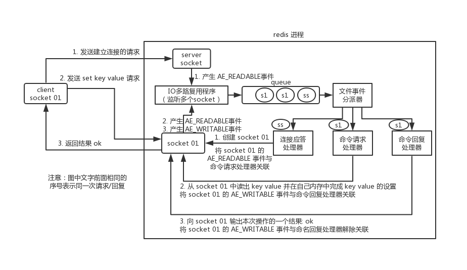

## 面试题
redis 和 memcached 有什么区别？redis 的线程模型是什么？为什么 redis 单线程却能支撑高并发？

## 面试官心理分析
这个是问 redis 的时候，最基本的问题吧，redis 最基本的一个内部原理和特点，就是 redis 实际上是个**单线程工作模型**，你要是这个都不知道，那后面玩儿 redis 的时候，出了问题岂不是什么都不知道？

还有可能面试官会问问你 redis 和 memcached 的区别，但是 memcached 是早些年各大互联网公司常用的缓存方案，但是现在近几年基本都是 redis，没什么公司用 memcached 了。

## 面试题剖析

### redis 和 memcached 有啥区别？

#### redis 支持复杂的数据结构
redis 相比 memcached 来说，拥有[更多的数据结构](redis-data-types.md)，能支持更丰富的数据操作。如果需要缓存能够支持更复杂的结构和操作， redis 会是不错的选择。

#### redis 原生支持集群模式
在 redis3.x 版本中，便能支持 cluster 模式，而 memcached 没有原生的集群模式，需要依靠客户端来实现往集群中分片写入数据。

#### 性能对比
由于 redis 只使用**单核**，而 memcached 可以使用**多核**，所以平均每一个核上 redis 在存储小数据时比 memcached 性能更高。而在 100k 以上的数据中，memcached 性能要高于 redis。虽然 redis 最近也在存储大数据的性能上进行优化，但是比起 memcached，还是稍有逊色。

### redis 的线程模型
redis 内部使用文件事件处理器 `file event handler`，这个文件事件处理器是单线程的，所以 redis 才叫做单线程的模型。它采用 IO 多路复用机制同时监听多个 socket，将产生事件的 socket 压入内存队列中，事件分派器根据 socket 上的事件类型来选择对应的事件处理器进行处理。

文件事件处理器的结构包含 4 个部分：
- 多个 socket
- IO 多路复用程序
- 文件事件分派器
- 事件处理器（连接应答处理器、命令请求处理器、命令回复处理器）

多个 socket 可能会并发产生不同的操作，每个操作对应不同的文件事件，但是 IO 多路复用程序会监听多个 socket，会将产生事件的 socket 放入队列中排队，事件分派器每次从队列中取出一个 socket，根据 socket 的事件类型交给对应的事件处理器进行处理。

来看客户端与 redis 的一次通信过程：

要明白，通信是通过 socket 来完成的，不懂的同学可以先去看一看 socket 网络编程。

首先，redis 服务端进程初始化的时候，会将 server socket 的 `AE_READABLE` 事件与连接应答处理器关联。

客户端 socket01 向 redis 进程的 server socket 请求建立连接，此时 server socket 会产生一个 `AE_READABLE` 事件，IO 多路复用程序监听到 server socket 产生的事件后，将该 socket 压入队列中。文件事件分派器从队列中获取 socket，交给**连接应答处理器**。连接应答处理器会创建一个能与客户端通信的 socket01，并将该 socket01 的 `AE_READABLE` 事件与命令请求处理器关联。

假设此时客户端发送了一个 `set key value` 请求，此时 redis 中的 socket01 会产生 `AE_READABLE` 事件，IO 多路复用程序将 socket01 压入队列，此时事件分派器从队列中获取到 socket01 产生的 `AE_READABLE` 事件，由于前面 socket01 的 `AE_READABLE` 事件已经与命令请求处理器关联，因此事件分派器将事件交给命令请求处理器来处理。命令请求处理器读取 socket01 的 `key value` 并在自己内存中完成 `key value` 的设置。操作完成后，它会将 socket01 的 `AE_WRITABLE` 事件与命令回复处理器关联。

如果此时客户端准备好接收返回结果了，那么 redis 中的 socket01 会产生一个 `AE_WRITABLE` 事件，同样压入队列中，事件分派器找到相关联的命令回复处理器，由命令回复处理器对 socket01 输入本次操作的一个结果，比如 `ok`，之后解除 socket01 的 `AE_WRITABLE` 事件与命令回复处理器的关联。

这样便完成了一次通信。

### 为啥 redis 单线程模型也能效率这么高？
- 纯内存操作
- 核心是基于非阻塞的 IO 多路复用机制
- 单线程反而避免了多线程的频繁上下文切换问题